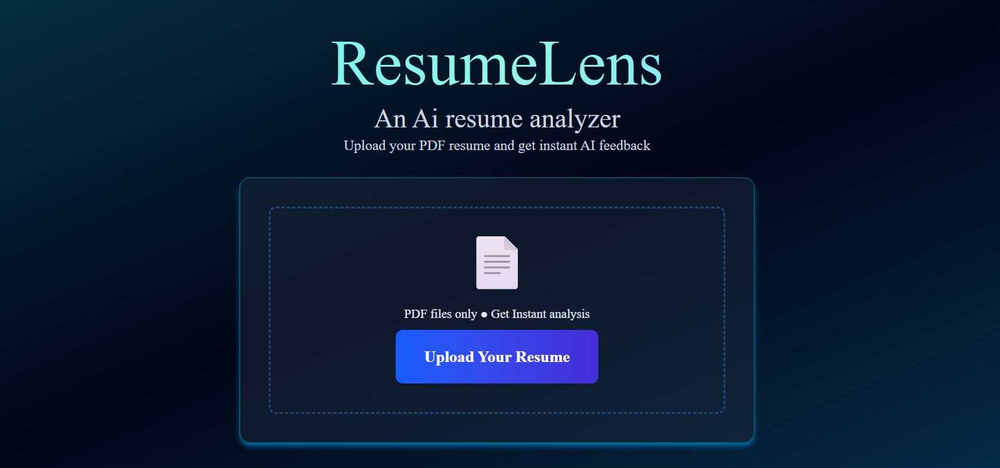
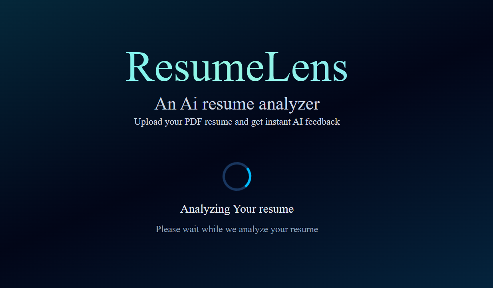
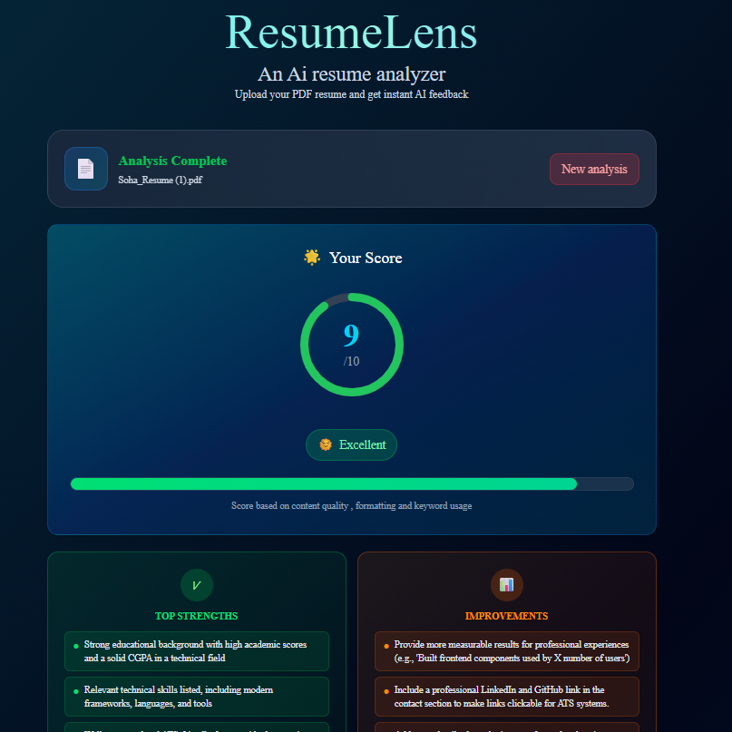
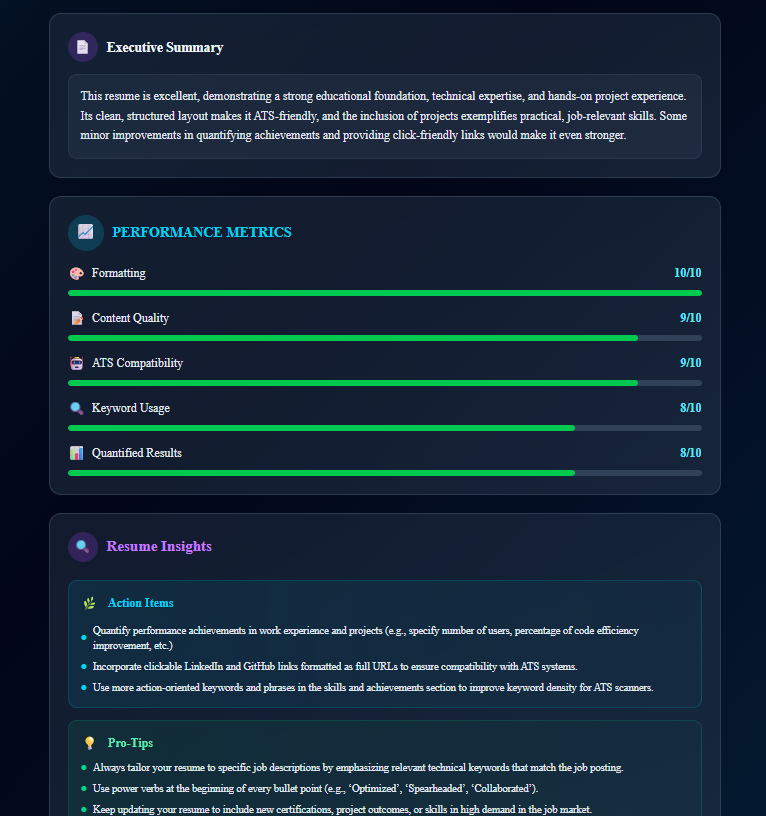

# ResumeLens 🚀

### AI-Powered Resume Analyzer & ATS Optimization Assistant

ResumeLens is an AI-powered resume analysis platform that helps job seekers improve their resumes by providing intelligent feedback, ATS-style scoring, skill gap analysis, and actionable recommendations.

Built with modern web technologies, ResumeLens uses AI to analyze uploaded resumes and generate insights that help candidates create stronger, more recruiter-friendly applications.

## ✨ Features

### 📄 Resume Upload & Parsing

* Upload your resume in PDF format
* Extract resume content automatically
* Process resume data using AI-powered analysis

### 🤖 AI Resume Analysis

* Analyze resume quality using AI
* Generate personalized feedback
* Identify strengths and improvement areas
* Suggest improvements for better job applications

### 📊 ATS Score Evaluation

* Get an ATS compatibility score
* Understand how recruiter systems may evaluate your resume
* Improve keyword optimization and structure

### 💡 Smart Recommendations

* AI-generated suggestions for:

  * Resume formatting
  * Skills improvement
  * Missing keywords
  * Experience descriptions
  * Professional presentation

### 🎨 Modern UI

* Clean and responsive interface
* Gradient-based design
* Smooth user experience
* Built with Tailwind CSS

---

## 🛠️ Tech Stack

### Frontend

* Next.js
* React.js
* Tailwind CSS
* TypeScript

### AI & Processing

* Puter.js AI APIs
* GPT-powered resume analysis
* PDF text extraction using pdf parsing libraries

### Tools & Deployment

* Git & GitHub
* Vercel

---

## 🏗️ Project Architecture

```
ResumeLens
│
├── app/
│   ├── components/
│   ├── pages/
│   └── styles/
│
├── public/
│
├── utils/
│   └── PDF extraction logic
│
├── package.json
└── README.md
```

---

## 🚀 Getting Started

### Clone the repository

```bash
git clone https://github.com/SohaRatnam2005/Resume-lens.git
```

### Navigate into the project

```bash
cd Resume-lens
```

### Install dependencies

```bash
npm install
```

### Run the development server

```bash
npm run dev
```

Open:

```
http://localhost:3000
```

---


## 📸 Screenshots

### 🏠 Landing Page


### 📄 Resume Upload


### 🤖 AI Analysis Dashboard



---

## 🎯 Future Improvements

* Resume comparison with job descriptions
* LinkedIn profile analysis
* Cover letter generator
* Interview question generation based on resume
* Resume templates
* User authentication and saved reports

---
Made with Love by Soha 💖
